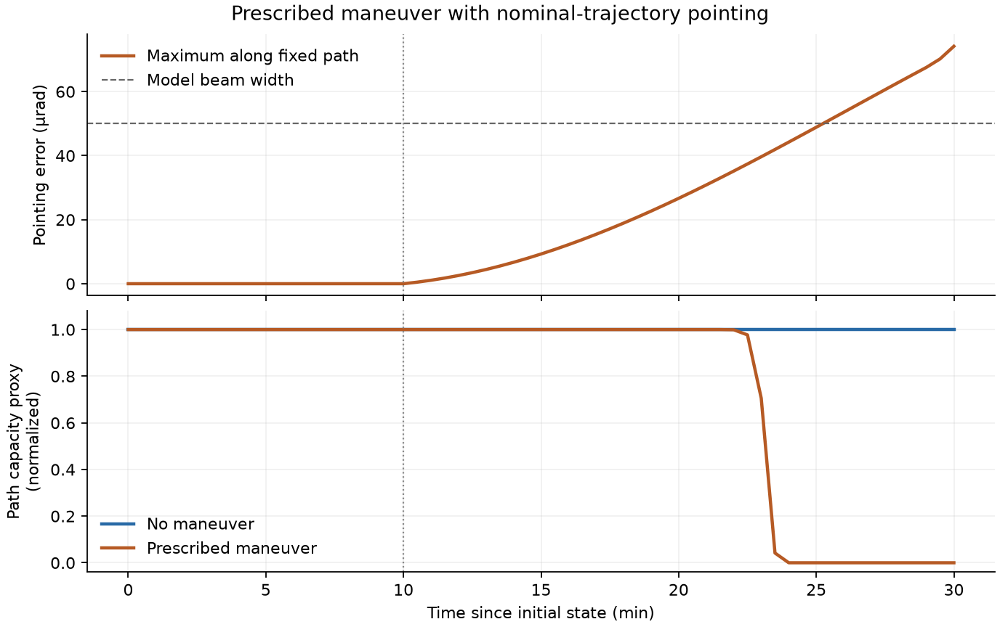

# LEO Maneuver Analysis

A Python toolkit for tracing how a prescribed satellite maneuver changes an
inter-satellite communication path: orbit propagation → line-of-sight error →
link quality → path metrics.

The included offline example uses a synthetic circular constellation and a
single transverse impulse. It compares the same nominal route with and without
the maneuver, exposing the trajectories and intermediate link calculations.
No accounts, downloaded catalogs, or external datasets are needed to run it.

## Quick start

Use Python 3.10 or newer in a virtual environment. From the repository directory:

```bash
python -m pip install ".[plot]"
python -m leo_maneuver_analysis --config examples/maneuver_impact.json --output runs/demo --plot
```

The simulation and figure generation take a few seconds on a typical desktop.
To run without plotting, install `.` and omit `--plot`. `leo-maneuver` is an
equivalent installed command. Paths are relative to the current working
directory; the package can be used from outside this repository after installation.

The output directory contains:

| File | Contents |
| --- | --- |
| `scenario.json` | Resolved parameters, including a backend override |
| `maneuver_trajectory.csv` | Nominal and maneuvered position/velocity of the maneuvering satellite |
| `link_metrics.csv` | Per-edge geometry, pointing error, and analytical link metrics for both cases |
| `path_metrics.csv` | Fixed route, status, and aggregate metrics for each snapshot |
| `maneuver_impact.png` | Optional figure generated from the same analysis |

Generated runs are ignored by Git. Reusing an output directory replaces the
named exports after they have been staged successfully. Unavailable path metrics
are blank in CSV files, rather than represented as zero delay or zero loss.

## Example: a transverse maneuver

The [scenario](examples/maneuver_impact.json) has 3 planes of 12 satellites at
550 km altitude and 53° inclination. Adjacent planes have half-slot phasing.
At 600 s, satellite 3 receives a 0.2 m/s transverse impulse in its local RTN
frame. States are sampled every 30 s over a 30-minute interval.

At the maneuver time, nominal propagation-delay routing selects
`0 → 1 → 2 → 3 → 4 → 5 → 6`. That route and its candidate edge set remain
fixed in both cases; range and Earth clearance are checked again at each sample.



After 20 minutes of post-maneuver propagation, the satellite is displaced by
about 273 m and the maximum pointing error along this path is about 74 µrad.
The path remains geometrically connected. Under the configured nominal-trajectory
tracking model, its capacity proxy approaches the model's numerical floor.
The geometric propagation delay changes only slightly.

This result illustrates the sensitivity of a narrow-beam model to an unaccounted
trajectory change. Updating the terminal's target trajectory or actively
reacquiring the link would require a different pointing model. Changing the
impulse, beam width, or source/destination IDs provides a small sensitivity study;
an off-path maneuver may have little effect on the selected path.

## Implementation

| Module | Responsibility |
| --- | --- |
| [config](src/leo_maneuver_analysis/config.py) | Immutable scenario parameters, unit conventions, JSON validation |
| [constellation](src/leo_maneuver_analysis/constellation.py) | Synthetic inertial initial states and plane/slot metadata |
| [propagation](src/leo_maneuver_analysis/propagation.py) | Propagator protocol, RTN conversion, impulse and finite-burn propagation |
| [network](src/leo_maneuver_analysis/network.py) | Structured ISL topology, nominal routing, link and path metrics |
| [pointing](src/leo_maneuver_analysis/pointing.py) | LOS angle and Gaussian pointing/packet-error model |
| [analysis](src/leo_maneuver_analysis/analysis.py) | Two-case orchestration with a common time grid and route |
| [export](src/leo_maneuver_analysis/export.py) | CSV output and optional headless plotting |

The modules use explicit state arrays and configuration objects. Importing the
package does not start an experiment, load catalogs, or write outputs.

```python
from dataclasses import replace
from leo_maneuver_analysis import load_config, run_analysis

config = load_config("examples/maneuver_impact.json")
result = run_analysis(replace(config, impulse_rtn_mps=(0.0, 0.1, 0.0)))
print(result.route)
print(result.snapshots[-1].maneuvered.capacity_proxy_mbps)
```

Position and velocity arrays have shape `(time, satellite, xyz)` in a common
Earth-centered inertial frame. Units are meters, seconds, m/s, radians, and Mbps;
inclination in the configuration is explicitly in degrees. Satellite IDs index
the array rows. The maneuver time is included exactly in the time grid even
when it is not a multiple of the sampling interval.

## Models and assumptions

- **Dynamics:** the default `scipy-j2` backend integrates Earth point-mass plus
  J2 gravity with constant spacecraft mass. The example uses an instantaneous
  velocity impulse. The propagation API also supports fixed-direction,
  constant inertial thrust, integrated separately during burn and coasting;
  there is no attitude, drag, or propellant depletion model.
- **Topology:** slot-neighbor links within a plane and nearest-neighbor links
  on adjacent planes. Greedy selection prioritizes intra-plane edges and
  enforces range, spherical-Earth clearance, and per-node degree limits.
  Link acquisition, terminal scheduling, and ground links are outside this model.
- **Pointing:** terminals follow the nominal LOS at each time, without updating
  it for the maneuver. For angular error θ and beam-width parameter β, the
  model uses `g = exp(-2(θ/β)²)` and `SNR = SNR₀ × g²`, followed by
  `BER = 0.5 × erfc(sqrt(SNR))`. Packet errors assume independent bit errors.
  This is an analytical sensitivity model, not a calibrated optical terminal.
- **Path metrics:** capacity is the minimum modeled link capacity along the
  path, and packet success is the product of per-hop success probabilities.
  Shared-link contention, queues, packet simulation, and adaptive routing are
  not included. `connected` reports geometric availability, not delivery success.
- **Retry-weighted delay:** geometric link delay is multiplied by a capped
  retry factor. This is a diagnostic proxy, not application latency or an ARQ
  timing model. Packet success has a `1e-12` numerical floor and retry factors
  are capped at 20 in the example; finite proxy values do not imply useful
  service when packet error approaches one.

## Optional Basilisk backend

```bash
python -m pip install ".[basilisk]"
python -m leo_maneuver_analysis --config examples/maneuver_impact.json --output runs/basilisk --backend basilisk
```

The adapter uses Basilisk's spacecraft module with Earth point-mass gravity and
constant mass. It does **not** include the default SciPy backend's J2 term, so
the two models should not be treated as numerically equivalent. Every run
records its backend and model. Requesting Basilisk without installing it fails
with an installation message; it does not silently fall back to SciPy.

For this fixed-step adapter, requested sample times and finite-burn durations
must be multiples of the integration step. The CLI's sampling interval,
maneuver time, and duration therefore need to align with `integrator_step_s`
when selecting Basilisk. Misaligned inputs fail explicitly; decrease the step
to represent a finer time grid.

The optional dependency is pinned to the locally checked version, `bsk==2.11.1`.
See the [official installation documentation](https://avslab.github.io/basilisk/Install.html)
for supported platforms and wheel availability.

## Validation

```bash
python -m pip install ".[dev]"
python -m pytest
```

Tests cover RTN geometry, zero-maneuver consistency, impulse continuity,
finite-burn behavior, topology constraints, weighted routing and disconnection,
pointing sensitivity, path aggregation, invalid configurations, and CLI exports.
Optional Basilisk tests are skipped unless that dependency is installed.
GitHub Actions checks the default backend on Python 3.10 and 3.12.

The local reference environment uses Python 3.12, NumPy 2.2.4, SciPy 1.14.1,
NetworkX 3.3 and Matplotlib 3.9.4. A separate clean installation was also checked
with NumPy 2.5.3, SciPy 1.18.1, NetworkX 3.7, Matplotlib 3.11.2, and Pytest 9.1.1.
Optional dynamics checks use Basilisk 2.11.1. The README figure is generated by
the default SciPy example. The GitHub-hosted CI will run when the repository is uploaded.

## Author and components

Maintained by **Haoyuan Zhao**. The propagation, topology, and analytical link
calculations were extracted and reorganized from satellite-network research code
into this standalone workflow. The synthetic fixture contains no operational
spacecraft records or measured performance claims.

Numerical integration uses [SciPy](https://scipy.org/), array operations use
[NumPy](https://numpy.org/), routing uses [NetworkX](https://networkx.org/), and
the optional dynamics adapter uses [Basilisk](https://avslab.github.io/basilisk/).
These dependencies retain their respective licenses. This repository currently
does not include a code license.
